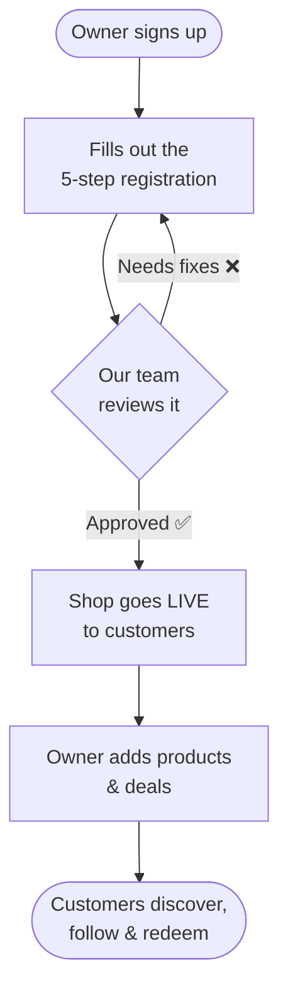
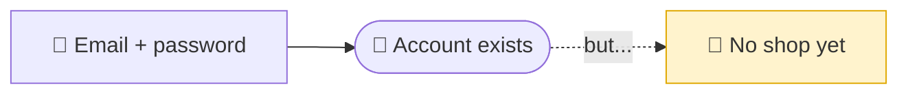
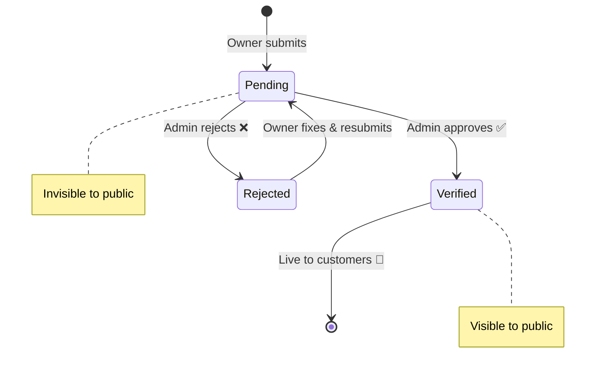
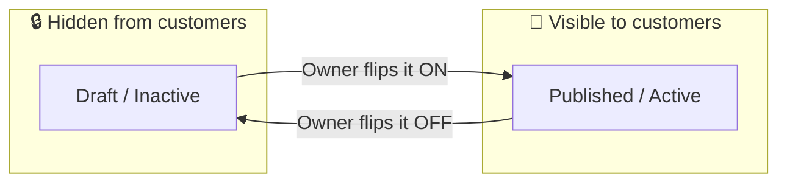
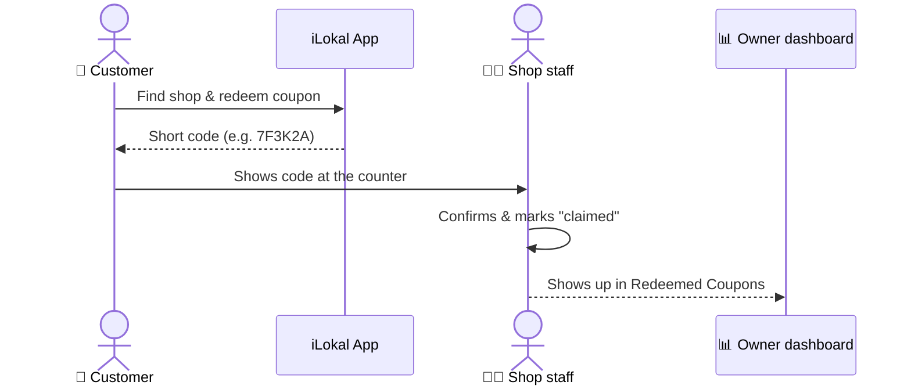
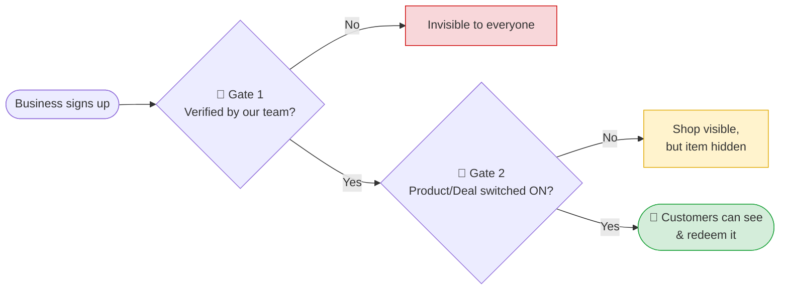

# How a Business Gets on iLokal — A Plain-Language Guide

*For the marketing team and anyone who doesn't live in the code.*

This explains the journey a business owner takes — from signing up to having their shop, products, and deals show up for customers in the iLokal app. No technical background needed.

> 💡 **The one thing to remember:** a business doesn't appear to customers the moment it signs up. It has to be **approved by our team first**, and the owner has to **switch things "on"** before customers can see them. More on both below.

---

## The journey at a glance

Think of it like opening a stall in a marketplace: you apply, the marketplace owner checks you're legit, and once you're approved you can put products on your shelves and post your promotions.

---

## The 6 stages, explained

### 1. Sign up & log in
The owner creates a business account with an email and password. From this point they have a login, but their business **does not exist yet** — they've only created the "person," not the "shop."

### 2. Register the business (a 5-step form)
A guided wizard walks the owner through everything we need:

| Step | What they provide | Why it matters for marketing |
| --- | --- | --- |
| 1. **Category** | What kind of business (café, salon, retail…) | Drives how/where they appear in the app |
| 2. **Shop info** | Name, description, location on the map | The location powers "Shops Near Me" |
| 3. **Gallery** | Logo + interior photos | This is the storefront customers see — visuals matter |
| 4. **Documents** | Proof the business is real | Used by our team to verify them |
| 5. **Review & submit** | Final check, then send | Locks it in for review |

After submitting, the business is in a **"Pending"** state — saved in our system but **invisible to the public**.

### 3. Our team reviews it (the big gate 🚦)
An admin on our side checks the details and documents, then either:
- **Approves** → the business becomes **"Verified"** and goes live to customers, **or**
- **Rejects** → the owner gets a reason and can fix and resubmit.

> **This is the hard gate.** Until a business is *Verified*, customers cannot see it anywhere in the app — no matter how complete the owner's setup is. Each physical branch/location also gets its own approval.

### 4. Manage the shop (the dashboard)
Once verified, the owner unlocks their dashboard — their control center:

| Section | What they do there |
| --- | --- |
| **Home / Analytics** | See views, redemptions, performance |
| **My Shop** | Edit name, description, logo, photos |
| **Branches** | Add or edit locations (each needs approval) |
| **Product Catalogue** | Add the products / menu items they sell |
| **Coupons & Deals** | Create promotions |
| **Redeemed Coupons** | Track who used their deals |

### 5. Add products and deals (the second gate 🚦)
This is the part marketing cares about most. Two key ideas:

- **Products** have an on/off switch. A product is only visible to customers when it's set to **Active**. Owners can prepare everything quietly and flip it live when ready.
- **Coupons & Deals** work the same way — they start as a **Draft** and only appear to customers once **Published** (and only between their start and expiry dates).

There are two kinds of promotions:
- **Coupon** — a standard discount a customer redeems at the shop.
- **Deal** — gets featured in the app's **Explore** feed (the big discovery section). Businesses on a **boosted plan** get larger, more eye-catching cards there.

Deals can also have rules, e.g.:
- "Customer must **follow** the business first to redeem."
- Limits like "max X redemptions per person" or "X total."
- Tied to a specific branch, or available everywhere.

### 6. Customers discover & redeem
Customers find the shop (nearby, explore, or by following it), redeem a coupon, and get a short code. At the counter, staff confirm the code and mark it as claimed. The owner watches all of this under **Redeemed Coupons**.

---

## Two gates marketing should never forget

| Gate | What it means | Why it exists |
| --- | --- | --- |
| 🚦 **Verification** | A business is invisible until *our team approves it* | Keeps fake/low-quality businesses out |
| 🚦 **Published / Active** | Products & deals are invisible until the owner switches them *on* | Lets owners set up privately, launch when ready |

So if a partner says *"I signed up but I'm not showing up!"* — check these two first: **Are they verified? Is the product/deal published?**

---

## Quick glossary (tech term → plain meaning)

| You might hear… | It means… |
| --- | --- |
| **Pending** | Submitted, waiting for our team's approval |
| **Verified** | Approved and live to customers |
| **Draft** | Created but hidden from customers |
| **Published / Active** | Switched on and visible to customers |
| **Branch** | A physical location of the business |
| **Redemption** | A customer used a coupon |
| **Claim** | Staff confirmed the coupon at the counter |
| **Follow** | A customer subscribed to a business's updates |
| **Boosted plan** | A paid plan that makes deals stand out more in Explore |

---

*Want the technical version with exact routes and database details? See [business-owner-flow.md](business-owner-flow.md).*
