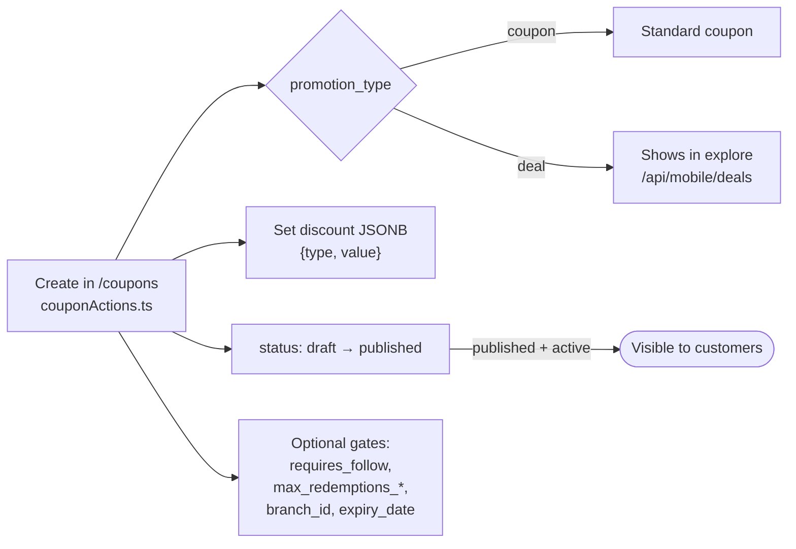

# Business Owner User Flow

How a business owner uses the iLokal admin dashboard — from account creation through registration, verification, and running promotions. Grounded in the current routes (`app/business/**`, `app/(auth)/**`, `app/admin/**`) and DB schema (`supabase/migrations/**`).

> Diagrams use [Mermaid](https://mermaid.js.org). GitHub, VS Code (with a Mermaid extension), and most markdown viewers render them inline.

---

## 1. Roles & gating states

The flow is gated by two independent status values:

| Where | Column | Values | Meaning for the owner |
| --- | --- | --- | --- |
| `profiles.role` | `role` | `admin` · `business_owner` · `user` | Owners sign up as `business_owner`; business login is restricted to this role (`authActions.ts`). |
| `profiles.status` | `status` | `active` · `inactive` · `suspended` | Account-level gate. A suspended account can't operate. |
| `businesses.status` | `verification_status` | `pending` · `verified` · (rejected) | A business is invisible to the public mobile app until an admin marks it `verified`. |
| `branches.status` | — | `pending_review` · `active` · `rejected` | Each branch goes through its own admin approval (`20260528000003`). |

The public mobile API only ever returns `businesses` where `status = 'verified' AND archived_at IS NULL` (RLS `"Public view verified businesses"`). So **verification is the hard gate** between "registered" and "live to customers."

---

## 2. End-to-end flow

```mermaid
flowchart TD
    Start([Visitor wants to list a business]) --> Signup

    subgraph ACCOUNT [Account · app/&#40;auth&#41;]
        Signup["Sign up<br/>/signup → signupAction"]
        Signup -->|"auth.signUp + profiles insert<br/>role = business_owner, status = active"| Login
        Login["Log in<br/>/login/business<br/>(role must = business_owner)"]
    end

    Login --> RegWizard

    subgraph REG [Registration wizard · app/business/registration]
        RegWizard["5-step wizard"]
        S1["1 · Business Category<br/>(business_categories / types)"]
        S2["2 · Shop Information<br/>name, description, location"]
        S3["3 · Gallery<br/>logo_url, interior_images[]"]
        S4["4 · Documents<br/>verification_docs_url[]"]
        S5["5 · Review & Submit"]
        RegWizard --> S1 --> S2 --> S3 --> S4 --> S5
        S5 -->|"POST /api/web/businesses<br/>(multipart FormData)"| Submitted
        Submitted["businesses row created<br/>status = 'pending'<br/>+ first branch"]
    end

    Submitted --> AdminReview

    subgraph ADMINREVIEW [Admin verification · app/admin]
        AdminReview{"Admin reviews<br/>docs & details"}
        AdminReview -->|approve| Verified["businesses.status = 'verified'"]
        AdminReview -->|reject| Rejected["status = rejected /<br/>branch rejection_reason"]
    end

    Rejected -.->|owner fixes & resubmits| RegWizard
    Verified --> Dashboard

    subgraph DASH [Business dashboard · app/business/&#91;businessId&#93;]
        Dashboard["Home / Analytics<br/>/business/:id"]
        Dashboard --> Shop["My Shop<br/>/shop · edit profile, logo, gallery"]
        Dashboard --> Branches["Branches<br/>/branches · add/edit + per-branch approval"]
        Dashboard --> Products["Product Catalogues<br/>/product-catalogues"]
        Dashboard --> Coupons["Coupons & Deals<br/>/coupons"]
        Dashboard --> Redeemed["Redeemed Coupons<br/>/redeemed-coupons"]
        Dashboard -.-> Billing["Subscription / Billing<br/>(planned — actions exist,<br/>not yet in nav)"]
    end

    Products --> PublicFeed
    Coupons --> PublicFeed
    PublicFeed([Live to customers via mobile API])
    Redeemed -.->|cashier validates code| ClaimFlow([Customer claim flow])
```

---

## 3. Step detail + schema mapping

### 3.1 Account creation
- **Route:** `/signup` (`app/(auth)/signup`) → `signupAction` (`authActions.ts`).
- **Writes:** `auth.users` via `supabase.auth.signUp`, then a `profiles` row with `role = 'business_owner'`, `status = 'active'`. (A DB trigger `on_auth_user_created` also backstops profile creation.)
- **Login:** `/login/business` — `businessLoginAction` rejects anything that isn't `role === 'business_owner'`.

### 3.2 Registration wizard
- **Route:** `/business/registration` — 5 steps defined in `registration/data/steps.tsx`:
  1. **Business Category** — picks `business_categories` / `business_types` (soft-deleted rows filtered by `deleted_at`).
  2. **Shop Information** — `name`, `description`, location (PostGIS point used later by `nearby_businesses`).
  3. **Gallery** — uploads `logo_url` and `interior_images[]` to the business images bucket.
  4. **Documents** — uploads `verification_docs_url[]` (and per-branch `branch_documents`).
  5. **Review & Submit** — `POST /api/web/businesses` with multipart `FormData`.
- **Writes:** one `businesses` row (`status = 'pending'`, `owner_id = auth.uid()`) plus the first `branches` row.

### 3.3 Verification (admin side)
- **Route:** `app/admin` (account-status / businesses review).
- Owner waits while `businesses.status = 'pending'`. The business and its products/coupons are **not** publicly visible yet (RLS).
- Admin flips `status → 'verified'` (or rejects). Branches independently move `pending_review → active`.
- **Branch approval is enforced on creation:** the add-branch wizard (`/branches/create`) inserts new branches with `status: 'pending_review'` and tells the owner up front it won't appear publicly until reviewed (`branch-create-content.tsx`, `step-branch-review.tsx`). A rejected branch shows its `rejection_reason` on the branch detail page.

### 3.4 Dashboard & store management
Sidebar nav (`app/business/[businessId]/libs/configs/config.ts`):

| Nav item | Route | Backing table(s) |
| --- | --- | --- |
| Home | `/business/:id` | analytics views (`user_redemptions`, etc.) |
| My Shop | `/business/:id/shop` | `businesses` |
| Product Catalogues | `/business/:id/product-catalogues` | `products` (+ `categories`) |
| Coupons & Deals | `/business/:id/coupons` | `coupons` |
| Redeemed Coupons | `/business/:id/redeemed-coupons` | `user_redemptions` |
| Branches | `/business/:id/branches` | `branches`, `branch_documents` |

### 3.5 Adding products
- **Route:** `/product-catalogues` → `productActions.ts`.
- **Key columns:** `products.status` is canonical — `'active' | 'unlisted' | 'disabled'` (NOT `inactive/archived`). `is_available` is kept in sync by trigger. Also `sale_price` (nullable), `category_id → categories(id)`, optional `branch_id`.
- Only `status = 'active'` products surface on the public mobile route.

### 3.6 Adding promos (coupons & deals)

- **Route:** `/coupons` → `couponActions.ts`, validated by `createCouponSchema` / `updateCouponSchema` (use `z.guid()` for ids).
- **Key columns (normalized in `20260523000000`):**
  - `code` (not `title`), `description`.
  - `discount` JSONB `{ type: 'percentage' | 'fixed_amount', value: number }`.
  - `status` `draft | published` — only `published` is acted on.
  - `promotion_type` `'coupon' | 'deal'` — `'deal'` feeds the explore bento (`/api/mobile/deals`).
  - `start_date`, `expiry_date`.
  - Caps: `max_redemptions_per_user`, `max_redemptions_global`, `current_redemptions`.
  - `requires_follow` (bool) — when true, customer must follow the business before redeeming.
  - `branch_id` (nullable) — `null` = all branches.
- **Visibility invariant:** a coupon is only live when `status = 'published' AND archived_at IS NULL AND start_date <= now()` (and not past `expiry_date`). Every display/redeem route enforces this triplet.

### 3.7 Redemption monitoring
- Customers redeem via mobile (`POST /api/protected/mobile/redemptions`) → inserts `user_redemptions` (`is_claimed = false`), with a server-generated 6-char `code`.
- At the counter, the claim flips `is_claimed = true` (`PATCH .../redemptions/[id]/claim`, atomic guard).
- Owner watches all of this under **Redeemed Coupons** (`/redeemed-coupons`), reading `user_redemptions`.

### 3.8 Billing / plan boost
- **Tables:** `subscription_plans` (admin-managed) + `business_subscriptions` (owner's active plan, `status`, `current_period_end`).
- Plans with `features_promo_boost = true` cause that business's deals to render as larger bento cards in the explore feed. Owner upgrades via `billingActions.ts`.

---

## 4. Critical-path summary

`signup (business_owner)` → `login` → `5-step registration` → **`status = pending`** → `admin verifies` → **`status = verified`** → dashboard unlocked → `add products (status=active)` + `create coupons/deals (publish)` → customers discover & redeem → owner tracks redemptions & upgrades plan.

The two non-obvious gates: **a business is invisible until admin-verified**, and **products/coupons are invisible until `active`/`published` respectively** — so an owner can fully set things up while still in draft/pending and nothing leaks to the public app early.
